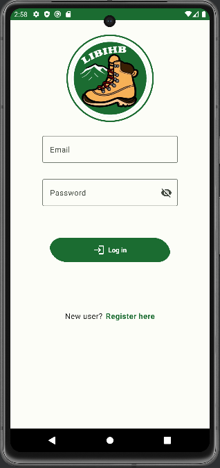
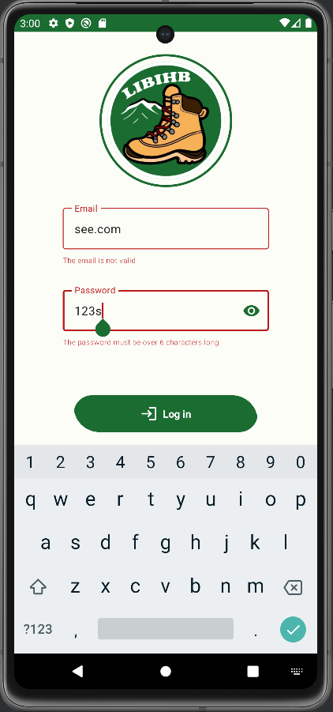
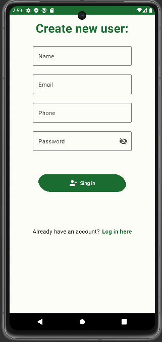
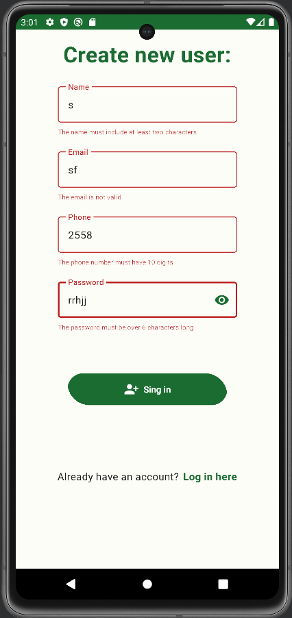

I hope you believe that life is better in hiking boots 🥾 :)) so this is a simple android 📱 travel application 🗺 built with composable functions that lets you record all the mountain peaks that you have conquered 🗻

‼‼WORK IN PROGRESS - the list below may suffer changes 😁

"Life is better in hiking boots" is an Android application that allows users to create, view, and edit their travel memories. The app will use a SQLite database to store the user's travel memories. The main features of the application are as follows: Splash Screen:

The application should have a splash screen that displays the app icon and the name of the app.
Main Screen: The main screen should display a list of travel memories. Each item in the list should display the following fields: • Location image • Place name • Place location • Date of travel
Navigation Drawer: The main screen should also have a navigation drawer with the following options: • Home (item) • About Us (item) • Contact Us (item) • Share (item) • Settings (item) • Logout (item) Add/Edit Travel Memory:
The application should allow users to add and edit travel memories. When the user adds a new travel memory, they should be able to enter the following information: • Place name (input) • Place location (use Google Map with Google Places API to get readable location) • Date of travel (date picker) • Type of travel (dropdown picker) • Mood (slider) • Notes (input) • Gallery Photos (select photos from the gallery) [optional] • Take Photos (take photos from the camera) [optional] When the user edits a travel memory, they should be able to edit all of the above fields. Details Screen:
The application should allow users to view the details of a travel memory. The details screen should display all of the fields mentioned in the "Add/Edit Travel Memory" section above. Additionally, the details screen should display the following information: • Weather at the location of the travel memory • Location of the travel memory on Google Maps (using Google Maps API)

Splash Screen:
- new splash screen api

Log in Screen: 

Log in fields validation: 
- valid email required
- valid password required

Register Screen:

Registration fields validation:
- name must be at least 2 characters long
- email must be valid
- phone must be valid
- password must be complex : min length of 6 characters: letters (uppercase and lowercase) and digits

App uses: -Material theme custom colors
          -Is compatible both in light/dark mode  
TODO NEXT - tie it to Firebase
